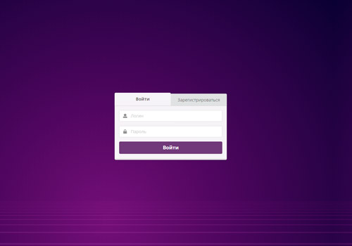

# Биржа Неткоинов

Сайт-биржа для крипто-стартапа. На этом сайте можно покупать внутреннюю валюту компании под названием Неткоин и передавать эту валюту другим пользователям сервиса. Основные части проекта реализованы: есть интерфейс взаимодействия с АPI (бэкендом, где производятся операции с пользователями и денежными средствами), и интерфейс взаимодействия с DOM (графическим интерфейсом, который вы видите в браузере). Задача – связать эти две части: сделать так, чтобы данные, введённые пользователем, отправлялись на сервер, а информация, предоставленная сервером, отобразилась пользователю.

## Структура проекта

Страницы, функционал которых был реализован:

1. Страница «Вход и регистрация»:

Код для реализации функционала этой страницы в файле `public/loginPage.js`.

Задание для страницы входа и регистрации находится по [ссылке](./md/loginpage.md).

2. Страница «Личный кабинет пользователя»:

Код для этой страницы в файле `public/homePage.js`.

Задание для страницы личного кабинета находится по [ссылке](./md/homepage.md).
